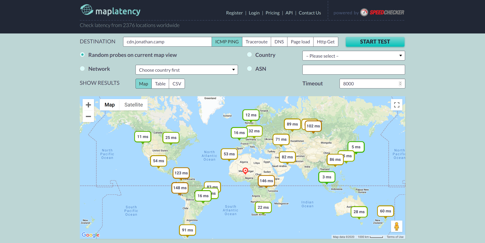

# multiregion-terraform
Example multi-region AWS Terraform application

**TL;DR**: launch ~56 EC2 instances in 18 regions with a single `terraform` command

Amazon has 18 data centers with ~56 availability zones spread around the world. This Terraform application launches EC2 instances in every possible zone, and ties them together into a single domain name that routes pings to the closest instance.

## Features

* Single `main.tf` with a module instance for each Amazon's [14 regions][1]
* Creates an EC2 instance in every region and availability zone
* Creates two Route 53 records (A and AAAA) with [latency based routing][2] to all EC2 instances
* All instances allow ICMP Echo Request (ping) from `0.0.0.0/0`
* Supports IPv4 _and_ IPv6

### Latency Map
Note the lower latency when the ping source is near to one of Amazon's datacenters:
[](https://raw.githubusercontent.com/kung-foo/multiregion-terraform/master/map_latency.png)

### Terraform Dependency Graph
[](https://raw.githubusercontent.com/kung-foo/multiregion-terraform/master/graph.png)

## How-to

Notes:

* **IMPORTANT**: edit [cdn/variables.tf](cdn/variables.tf) and set `r53_zone_id` and `r53_domain_name`
* requires Terraform >= v0.12
* override the Amazon credential [profile settings][3] by setting `AWS_PROFILE=blah`
* optionaly update `blacklisted_az` with any availibility zones that might not support the instances types you want
* comment out regions in [main.tf](main.tf) to test a smaller deployment
* Terraform types used: `aws_ami`, `aws_vpc`, `aws_internet_gateway`, `aws_subnet`, `aws_route_table`, `aws_route_table_association`, `aws_security_group`, `aws_instance`, and `aws_route53_record`

```
$ terraform init
...

# replace 'personal' with the name of your AWS profile in ~/.aws/crendentials or leave blank for 'default'
$ AWS_PROFILE=personal terraform plan
module.cdn-us-east-1.data.aws_ami.default: Refreshing state...
module.cdn-us-west-1.data.aws_ami.default: Refreshing state...
...
Plan: 32 to add, 0 to change, 0 to destroy.

$ AWS_PROFILE=personal terraform apply
module.cdn-us-west-1.data.aws_ami.default: Refreshing state...
module.cdn-us-east-1.data.aws_ami.default: Refreshing state...
...
Apply complete! Resources: 32 added, 0 changed, 0 destroyed.

$ dig +short @8.8.8.8 cdn.jonathan.camp
52.207.230.71
52.90.73.117
52.91.127.142
54.198.56.163

$ dig +short @8.8.8.8 cdn.jonathan.camp AAAA
2a05:d01c:f93:2701:c9ab:9b4d:c81:9f05
2a05:d01c:f93:2700:604a:53ae:33b8:24c0

# print all servers using jq (https://stedolan.github.io/jq/)
$ jq -r '[.resources[].instances[] | select(.attributes.public_ip != null) | .attributes.public_ip] | .[]' terraform.tfstate
18.230.154.45
54.233.83.81
18.231.187.164
15.206.28.49
15.206.88.49
3.7.58.137
...
]
```

[1]: https://docs.aws.amazon.com/AWSEC2/latest/UserGuide/using-regions-availability-zones.html#concepts-available-regions
[2]: https://docs.aws.amazon.com/Route53/latest/DeveloperGuide/routing-policy.html#routing-policy-latency
[3]: https://www.terraform.io/docs/providers/aws/#shared-credentials-file
[4]: https://stedolan.github.io/jq/
